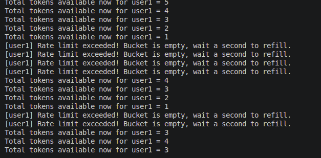
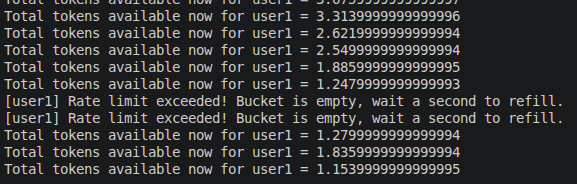

# RateLimiters

## smol implementation

Two rate limiting algorithms for request throttling.

---

## What's in here?

### 1. Fixed Window Rate Limiter (`/fw`)
- **concept:** 5 requests per 10 second window
- **how it works:** tracks user state in a Map, resets every 10 seconds, blocks excess requests
- **use case:** simple time-based rate limiting

**endpoint:**
```bash
curl "http://localhost:3000/fw?clientID=user1"
```

---

### 2. Token Bucket Rate Limiter (`/tb`)
- **concept:** bucket with 5 tokens, refills at 2 tokens per second
- **how it works:** each request consumes 1 token, tokens refill automatically based on elapsed time
- **use case:** smooth, continuous rate limiting with no sudden cutoffs

**endpoint:**
```bash
curl "http://localhost:3000/tb?clientID=user1"
```
---



---

## Observation: Fractional Token Accumulation

The token bucket implementation was refined to allow fractional tokens to accumulate over time. Instead of truncating with `Math.floor()`, the algorithm now maintains precise sub-token values between requests.

**What changed:**
```javascript
// Before:
const tokensToAdd = Math.floor(elapsedTime * (refillRate / 1000));

// After:
const tokensToAdd = (elapsedTime * (refillRate / 1000));
```

**Why it matters:** This creates smoother rate limiting. With fractional accumulation, short intervals (e.g., 150ms) contribute partial tokens that compound over time, rather than being discarded. Only when total tokens ≥ 1.0 is a full request allowed (checked via `if (user.totalTokens > 1)`).

**Visual example:**


The output shows tokens accumulating as decimals (3.62..., 2.53..., 1.84...) until depleted, then refilling gradually.

---

## Running

```bash
npm install express
npx nodemon server.js
```

Server runs on `http://localhost:3000`

---

## Files

- `server.js` - Express application with route handlers
- `fwRateLimiter.js` - fixed window middleware implementation
- `tbRateLimiter.js` - token bucket middleware implementation

---

## Features

- Per-user tracking with clientID isolation
- HTTP 429 response on rate limit hit
- Console logging for token state visibility
- Clean middleware pattern

---

## Rate limit exceeded

```
[user1] Rate limit exceeded! Tokens = 0
HTTP 429: Rate limit exceeded. Try again later.
```

After approximately 1 second, tokens refill and requests succeed again.

