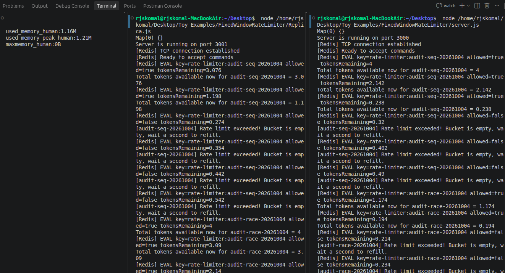

# RateLimiters

## smol implementation.

Two rate limiting algorithms for request throttling.

---

## What's in here?

### 1. Fixed Window Rate Limiter (`/fw`)
- **concept:** 5 requests per 10 second window
- **how it works:** tracks user state in a Map, resets every 10 seconds, blocks excess requests
- **use case:** simple time-based rate limiting

**endpoint:**
```bash
curl "http://localhost:3000/fw?clientID=user1"
```

---

### 2. Token Bucket Rate Limiter (`/tb`)
- **concept:** bucket with 5 tokens, refills at 2 tokens per second
- **how it works:** each request consumes 1 token, tokens refill automatically based on elapsed time
- **use case:** smooth, continuous rate limiting with no sudden cutoffs

**endpoint:**
```bash
curl "http://localhost:3000/tb?clientID=user1"
```
---


---

## Observation: Fractional Token Accumulation

The token bucket implementation was refined to allow fractional tokens to accumulate over time. Instead of truncating with `Math.floor()`, the algorithm now maintains precise sub-token values between requests.

**What changed:**
```javascript
// Before:
const tokensToAdd = Math.floor(elapsedTime * (refillRate / 1000));

// After:
const tokensToAdd = (elapsedTime * (refillRate / 1000));
```

**Why it matters:** This creates smoother rate limiting. With fractional accumulation, short intervals (e.g., 150ms) contribute partial tokens that compound over time, rather than being discarded. A request is allowed when total tokens are at least 1.0, i.e. `if (user.totalTokens >= 1)` in the logic and the Redis Lua script equivalent.

**Visual example:**


The output shows tokens accumulating as decimals (3.62..., 2.53..., 1.84...) until depleted, then refilling gradually.

---

## From One Process to a Distributed Rate Limiter

### 1. Why the original operation was atomic only in one process

The fixed-window limiter stores user state in a local JavaScript `Map`. A request reads the user's counter, updates it, and decides whether to continue without an `await` between those operations. Node.js runs that synchronous section on one event loop, so two requests handled by the same process cannot interleave in the middle of the update.

That behavior is effectively atomic for a single server instance. It does not work when the application is distributed. Each server process has its own `Map`, so `server.js` on port 3000 and `Replica.js` on port 3001 would each believe that `user1` has a separate limit. The user could therefore bypass the intended global limit by alternating requests between replicas.

### 2. Making the state distributed

The token-bucket limiter keeps each client's state in Redis, shared by both application instances. Both servers use the same key for a client:

```text
rate-limiter:<clientID>
```

For `user1`, the Redis hash contains:

```text
totalTokens
lastRefillTime
```

The middleware calls `rateLimitCheck()` in `sharedStore.js`, which sends the token-bucket Lua script to Redis with one `EVAL` command. Redis stores `totalTokens` and `lastRefillTime` in the client's hash. Both servers therefore read and update the same bucket, rather than maintaining independent process-local copies.

### 3. How Redis and `sharedStore.js` are used

`sharedStore.js` owns the Redis client and exposes a small storage API:

- `rateLimitCheck(clientID, bucketSize, refillRate)` invokes `scripts/tokenBucketCheck.lua` using Redis `EVAL`.
- The Lua script reads and updates the hash fields `totalTokens` and `lastRefillTime`, decides whether to allow the request, and sets the key's expiry.
- Connection, read, write, and Redis memory logs make the shared state visible during testing.

The older `getUserState()` and `setUserState()` helpers are still exported, but the active `/tb` request path uses the atomic Lua operation instead.

The two running servers can be verified by alternating requests for the same client:

```bash
for i in 1 2 3 4 5 6 7 8 9 10; do
	if [ $((i % 2)) -eq 1 ]; then port=3000; else port=3001; fi
	curl "http://localhost:$port/tb?clientID=user1"
done
```

Both terminals should log reads and writes for `rate-limiter:user1`. The token count should decrease across both processes, and both servers should eventually return HTTP 429. This confirms that they are using one shared bucket rather than two local buckets.


### 4. Atomic updates across distributed application instances

The current `/tb` path avoids the earlier read/modify/write race. The application sends one `EVAL` command to Redis. The script performs the state read, refill calculation, token decision, state write, and expiry update without another Redis command interleaving in the middle. Redis serializes command execution, so two requests arriving from different application instances cannot both act on the same stale token count.

Distribution is preserved because `server.js` and `Replica.js` both send the same client key to the same Redis service. The JavaScript middleware still awaits the result of `EVAL`; atomicity comes from doing the entire state transition inside one Redis-side script, not from avoiding `await` in Node.js.

The script currently receives `Date.now()` from the application process. Lua keeps each update atomic, but clocks on separate machines can still differ; using Redis `TIME` inside the script would remove that cross-host clock-skew dependency.

### 5. Redis key expiry and memory growth

The Lua script calls `EXPIRE` after every `/tb` check, including rejected requests. Its timeout is `ceil(bucketSize / refillRate) + 60` seconds. With the current bucket size of 5 and refill rate of 2 tokens per second, the key expires after 63 seconds without requests. A request refreshes that idle timeout, so a continuously active client retains its state while an inactive client's state is eventually removed.

This addresses indefinite retention for one-time clients. Expiry removes keys from the Redis keyspace and releases their data; the process's reported memory or operating-system RSS may not fall by exactly the same amount immediately because Redis and its allocator retain baseline and reusable memory. `DBSIZE`, `TTL`, and `INFO memory` help distinguish key expiry from allocator-level memory reporting.

In the latest check, a test key had expired (`EXISTS` returned 0 and `TTL` returned -2), and `DBSIZE` was 0. Redis reported about 1.18 MB used, which is mostly server/runtime overhead at this tiny test scale. The 40-client test also showed finite TTLs (a sample had about 41 seconds remaining shortly after creation).

### 6. What the Redis changes do, and what they do not

#### Redis storage model

Each client has one Redis hash named `rate-limiter:<clientID>`. The hash contains `totalTokens` and `lastRefillTime`. The Lua script creates the initial full bucket on a missing key, updates the token count for each request, and refreshes the key's expiry. Both application processes share this hash through Redis.

#### Race prevention while remaining distributed

The earlier approach used separate read, application-side calculation, and write commands. Concurrent requests could read the same old value and overwrite each other's updates. The Lua script now combines those operations into one atomic Redis execution. Both server processes remain distributed application instances; Redis is their shared coordination point. This removes the stale-read/lost-update race in the token-bucket state transition. The observed burst may include more than five allowed requests because tokens refill at 2 per second while requests are being processed; the script applies the refill rule on every request.

#### Redis availability: still a single point of failure

Redis is still a SPOF in this setup. The current Redis instance reports `role:master` and `connected_slaves:0`, and the application has no Redis failover configuration. If that Redis instance is unavailable, `/tb` cannot check the shared bucket and currently responds with HTTP 500. The Lua script solves atomicity; it does not provide Redis high availability.

To reduce this availability risk later, deploy Redis with a replica and automatic failover, such as a managed Redis HA service or Redis Sentinel with a correctly configured replica and quorum. Redis Cluster is another option when sharding and cluster failover are needed. Application-local fallback is not equivalent: replicas would each enforce separate local buckets and could disagree about the global limit. A fallback policy must explicitly choose availability versus consistent enforcement.

#### Reproduce the request checks

Start the two application instances in separate terminals:

```bash
node server.js
node Replica.js
```

Single requests to each instance:

```bash
curl -i "http://localhost:3000/tb?clientID=user1"
curl -i "http://localhost:3001/tb?clientID=user1"
```

Twelve sequential requests, alternating servers:

```bash
for i in $(seq 1 12); do
	if [ $((i % 2)) -eq 1 ]; then port=3000; instance=server.js; else port=3001; instance=Replica.js; fi
	printf 'seq%02d %s ' "$i" "$instance"
	curl --max-time 5 -sS -o /dev/null -w '%{http_code}\n' "http://localhost:$port/tb?clientID=audit-seq"
done
```

One hundred concurrent requests split across the two instances:

```bash
seq 1 100 | xargs -P 100 -I{} sh -c 'if [ $(({} % 2)) -eq 1 ]; then port=3000; else port=3001; fi; curl --max-time 10 -sS -o /dev/null -w "%{http_code}\n" "http://localhost:${port}/tb?clientID=audit-race"' | sort | uniq -c
```

Forty unique client IDs, alternating between instances:

```bash
seq 1 40 | xargs -P 20 -I{} sh -c 'if [ $(({} % 2)) -eq 1 ]; then port=3000; else port=3001; fi; curl --max-time 10 -sS -o /dev/null -w "%{http_code}\n" "http://localhost:${port}/tb?clientID=audit-client-{}"' | sort | uniq -c
```

Inspect a client's stored hash and expiry, the key count, memory, and replication status:

```bash
redis-cli HGETALL rate-limiter:user1
redis-cli TTL rate-limiter:user1
redis-cli DBSIZE
redis-cli INFO memory
redis-cli INFO replication
```

#### Observed test output



The alternating run shared one bucket across both instances:

```text
seq01 server.js  200
seq02 Replica.js 200
seq03 server.js  200
seq04 Replica.js 200
seq05 server.js  200
seq06 Replica.js 429
seq07 server.js  429
seq08 Replica.js 429
seq09 server.js  429
seq10 Replica.js 429
seq11 server.js  429
seq12 Replica.js 429
```

The concurrent run returned `7 x 200` and `93 x 429`; the count of successful requests can vary slightly with elapsed time because of token refill during the burst. All 40 unique-client requests returned `200`. Redis memory at that point was:

```text
used_memory_human: 1.17M
used_memory_peak_human: 1.21M
maxmemory_human: 0B
```

`maxmemory_human: 0B` means Redis has no configured memory limit. These results exercise the implementation but are not a formal proof of correctness under every production failure mode.


---

## Running

```bash
npm install express
npx nodemon server.js
```

Server runs on `http://localhost:3000`

---

## Files

- `server.js` - Express application with route handlers
- `fwRateLimiter.js` - fixed window middleware implementation
- `tbRateLimiter.js` - token bucket middleware implementation
- `sharedStore.js` - Redis-backed shared state implementation
- `Replica.js` - second server instance used to verify distributed state

---

## Features

- Per-user tracking with clientID isolation
- HTTP 429 response on rate limit hit
- Console logging for token state visibility
- Clean middleware pattern

---

## Rate limit exceeded

```
[user1] Rate limit exceeded! Tokens = 0
HTTP 429: Rate limit exceeded. Try again later.
```

After approximately 1 second, tokens refill and requests succeed again.

