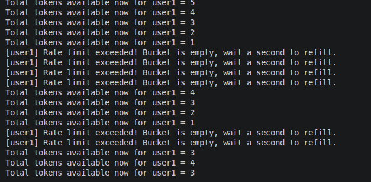
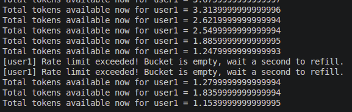
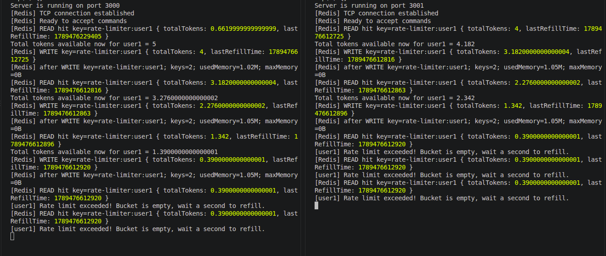

# RateLimiters

## smol implementation.

Two rate limiting algorithms for request throttling.

---

## What's in here?

### 1. Fixed Window Rate Limiter (`/fw`)
- **concept:** 5 requests per 10 second window
- **how it works:** tracks user state in a Map, resets every 10 seconds, blocks excess requests
- **use case:** simple time-based rate limiting

**endpoint:**
```bash
curl "http://localhost:3000/fw?clientID=user1"
```

---

### 2. Token Bucket Rate Limiter (`/tb`)
- **concept:** bucket with 5 tokens, refills at 2 tokens per second
- **how it works:** each request consumes 1 token, tokens refill automatically based on elapsed time
- **use case:** smooth, continuous rate limiting with no sudden cutoffs

**endpoint:**
```bash
curl "http://localhost:3000/tb?clientID=user1"
```
---



---

## Observation: Fractional Token Accumulation

The token bucket implementation was refined to allow fractional tokens to accumulate over time. Instead of truncating with `Math.floor()`, the algorithm now maintains precise sub-token values between requests.

**What changed:**
```javascript
// Before:
const tokensToAdd = Math.floor(elapsedTime * (refillRate / 1000));

// After:
const tokensToAdd = (elapsedTime * (refillRate / 1000));
```

**Why it matters:** This creates smoother rate limiting. With fractional accumulation, short intervals (e.g., 150ms) contribute partial tokens that compound over time, rather than being discarded. Only when total tokens ≥ 1.0 is a full request allowed (checked via `if (user.totalTokens > 1)`).

**Visual example:**


The output shows tokens accumulating as decimals (3.62..., 2.53..., 1.84...) until depleted, then refilling gradually.

---

## From One Process to a Distributed Rate Limiter

### 1. Why the original operation was atomic only in one process

The fixed-window limiter stores user state in a local JavaScript `Map`. A request reads the user's counter, updates it, and decides whether to continue without an `await` between those operations. Node.js runs that synchronous section on one event loop, so two requests handled by the same process cannot interleave in the middle of the update.

That behavior is effectively atomic for a single server instance. It does not work when the application is distributed. Each server process has its own `Map`, so `server.js` on port 3000 and `Replica.js` on port 3001 would each believe that `user1` has a separate limit. The user could therefore bypass the intended global limit by alternating requests between replicas.

### 2. Making the state distributed

The token-bucket limiter now keeps user state in a shared Redis store instead of process memory. Both application instances use the same key for a client:

```text
rate-limiter:<clientID>
```

For `user1`, the Redis hash contains:

```text
totalTokens
lastRefillTime
```

The middleware in `tbRateLimiter.js` reads the hash, calculates refill and consumption, and writes the updated state back through `sharedStore.js`. Since both servers use the same Redis key, a request received by either server observes the state left by the other server.

### 3. How Redis and `sharedStore.js` are used

`sharedStore.js` owns the Redis client and exposes a small storage API:

- `getUserState(clientID)` reads the user's hash with `HGETALL`.
- `setUserState(clientID, totalTokens, lastRefillTime)` writes the hash with `HSET`.
- `initializeUserIfNotExists(...)` creates the initial bucket state when no hash exists.
- Connection, read, write, and Redis memory logs make the shared state visible during testing.

The two running servers can be verified by alternating requests for the same client:

```bash
for i in 1 2 3 4 5 6 7 8 9 10; do
	if [ $((i % 2)) -eq 1 ]; then port=3000; else port=3001; fi
	curl "http://localhost:$port/tb?clientID=user1"
done
```

Both terminals should log reads and writes for `rate-limiter:user1`. The token count should decrease across both processes, and both servers should eventually return HTTP 429. This confirms that they are using one shared bucket rather than two local buckets.



### 4. The new atomicity problem and the trade-off

Redis gives the replicas a common source of truth, but the current token-bucket update is not one atomic Redis operation. It is a sequence of `HGETALL`, local calculation, and `HSET` commands. If two replicas handle requests for the same user at the same time, both can read the same token count, both can approve a request, and the later write can overwrite the earlier write.

This is the trade-off in the current implementation:

- Local memory provides simple, effectively atomic synchronous updates, but state is not shared between replicas.
- Redis shares state between replicas, but separate read and write commands introduce a race under concurrent traffic.

The usual next step is to move the read, refill calculation, limit check, and write into one Redis-side atomic operation, for example a Lua script or a Redis transaction with appropriate optimistic locking. That would preserve the distributed state while preventing lost updates.

### 5. Remaining issue: the Redis store does not shrink yet

User hashes currently have no expiration or cleanup policy. Therefore, once `rate-limiter:userA` is created, it remains in Redis even if `userA` makes one request and does not return for 1,000 days. As the number of client IDs grows, the key count and memory usage can grow as well.


---

## Running

```bash
npm install express
npx nodemon server.js
```

Server runs on `http://localhost:3000`

---

## Files

- `server.js` - Express application with route handlers
- `fwRateLimiter.js` - fixed window middleware implementation
- `tbRateLimiter.js` - token bucket middleware implementation
- `sharedStore.js` - Redis-backed shared state implementation
- `Replica.js` - second server instance used to verify distributed state

---

## Features

- Per-user tracking with clientID isolation
- HTTP 429 response on rate limit hit
- Console logging for token state visibility
- Clean middleware pattern

---

## Rate limit exceeded

```
[user1] Rate limit exceeded! Tokens = 0
HTTP 429: Rate limit exceeded. Try again later.
```

After approximately 1 second, tokens refill and requests succeed again.

